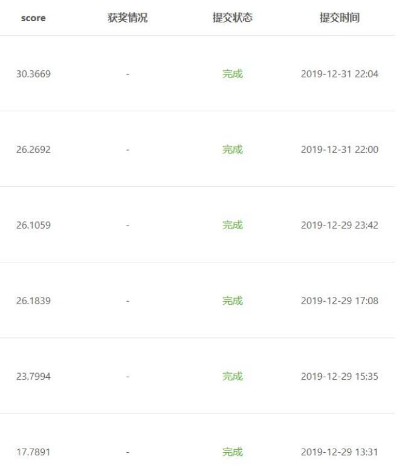
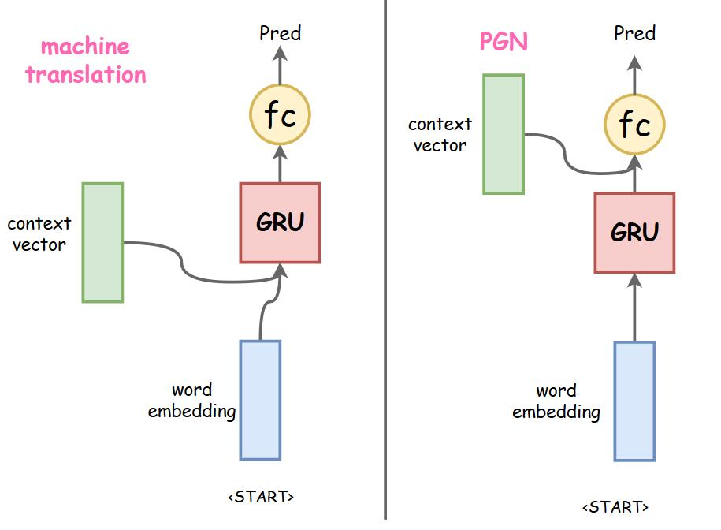
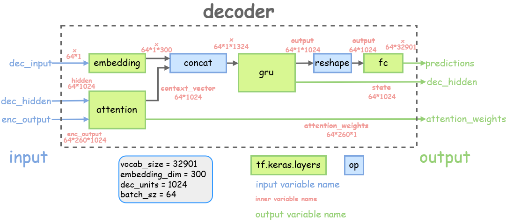
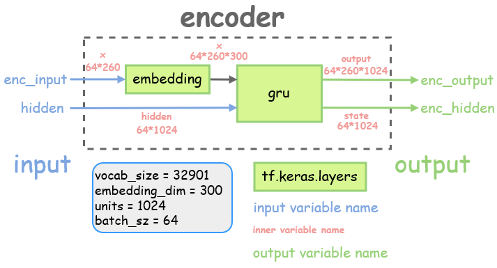
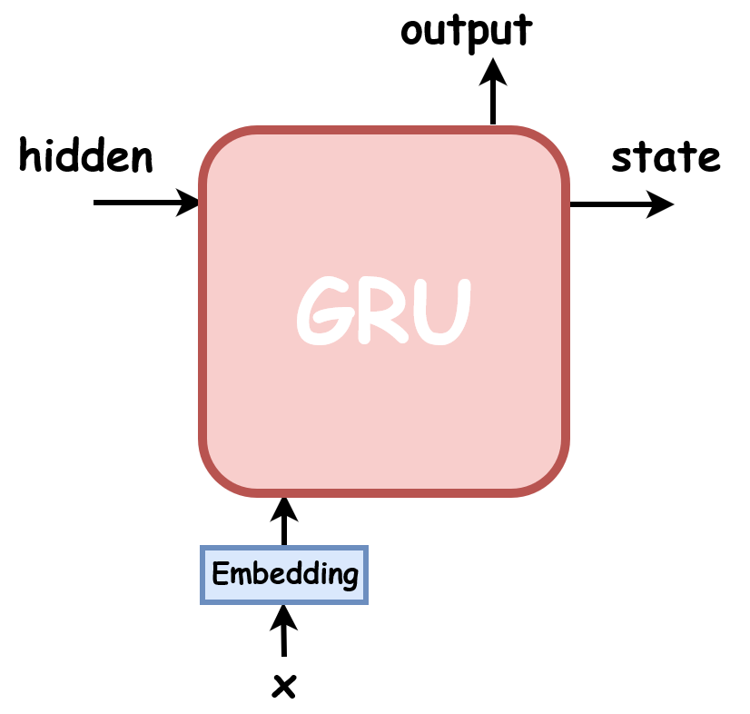

# 问答推理与摘要

[开课吧](https://www.kaikeba.com/)的NLP课程，项目一中带老师大家参加的百度AI Studio的[问答推理与摘要](https://aistudio.baidu.com/aistudio/competition/detail/3)的比赛项目代码。

:sweat_smile:虽然模型效果只有七八十分的大佬的一半还不到，收获还是挺多的。


# 项目代码简介

pgn和seq2seq_tf2文件夹下放的是两个模型。

utils文件夹里是相关的辅助模型训练测试的代码。

notebook文件夹是我在调试代码时的笔记

data文件夹放数据(暂时还未上传)


# 模型结构的改进



## Decoder的改进1

原本模型decoder结构是和tensorflow的[机器翻译示例](https://tensorflow.google.cn/tutorials/text/nmt_with_attention)模型的decoder结构一样的。

词向量的训练

12月31号之前，我的pgn跑出来的结果总是很差，图中12月29号的23.79分和17.78分就是pgn的结果，甚至比seq2seq还糟糕。

痛定思痛，好好看了[pgn的论文](http://arxiv.org/pdf/1704.04368v2.pdf)和[注意力机制的论文](https://arxiv.org/pdf/1409.0473.pdf)后，我发现虽然说都是seq2seq模型。二者还是有差别的，比如：**获得的上下文向量context_vector**的用法：

- 机器翻译模型是把context_vector和decoder输入词的词向量拼接后输进gru单元，gru的输出接入一个全连接层，算出预测词的分布

- PGN的gru单元输入就只有输入词的词向量，context_vector是和gru的输出做拼接，再输入全连接层进行预测，论文里是有两层全连接层如果我没理解错的话。

+b^{'}))

区别如下图



我其实不太确定之前pgn效果不好，是否是因为我用了机器翻译的结构

反正后来我把pgn的decoder改进成右图的结构后，pgn模型效果提升得很明显， 仅仅一个epoch的得分就达到了26分(第一张图第二个结果)，seq2seq需要跑6轮才能得到这个分数。

## Decoder的改进2

我后来发现
把decoder中的 [`tf.keras.layers.GRU`单元](https://tensorflow.google.cn/api_docs/python/tf/keras/layers/GRU?hl=en&version=stable)换成

[`tf.keras.layers.GRUCell`单元](https://tensorflow.google.cn/api_docs/python/tf/keras/layers/GRUCell?hl=en&version=stable)，代码会更加简洁，省去了很多维度上tf.squeeze, tf.expand_dims的操作

而且单步调用的时候也更加方便

详见 `pgn/layers.py` Decoder部分

除此之外，我还把attention融进了decoder，这样代码看起来会更简洁


## calc_final_dist()的更改

这部分的代码我进行了比较大的更改，也说不上是优化

源代码里有大量的**列表生成式** ，比如

```
vocab_dists = [p_gen * dist for (p_gen, dist) in zip(p_gens, vocab_dists)]
```

在[查阅资料](https://tensorflow.google.cn/guide/function?hl=en#batching)了解到，列表太多的话用`@tf.function`加速代码反而效率不高。（虽然到最后我也没用成tf.function加速代码）

所以我把`calc_final_dist()`部分涉及到列表生产式的运算全部转换成了tensor之间的运算，经过对比发现，运算得到的`final_dists`结果和之前是一致的

一定程度上，部分代码的可读性也增强了，例：

```
_vocab_dists_pgn = vocab_dists * p_gens
```

详见 pgn/model.py `_calc_final_dist`部分


## 损失函数的优化

由于之前一直追求尽量实现tensor运算，摒弃list，我的损失函数看起来特别简洁：
比如`log_loss()`

```python
def _log_loss(target, pred, dec_mask):
    loss_ = loss_object(target, pred)
    loss_ *= dec_mask
    return  tf.reduce_mean(loss_)
```

`cov_loss()`

```Python
def _coverage_loss(attentions, coverages, dec_mask):
    cov_loss = tf.minimum(attentions, coverages)
    cov_loss = tf.expand_dims(dec_mask, -1) * cov_loss
    cov_loss = tf.reduce_sum(cov_loss, axis=2)
    return tf.reduce_mean(cov_loss)
```

我觉得这也算是一个优化~~

`详见 pgn/loss.py`

# 总结和下一步的工作

之后结合新学的知识再继续改进模型吧，继续优化代码，增加可读性。

其他：

- 想办法整整tf.function加速运算(0%)
- 实现beam_search的加速。（因为beam_search预测得实在太慢，模型的跑分全是用的greedy_search）(0%)
- 把gru单元换成lstm单元试试(80%)

# 顺便推荐一下下我的notebook


里边`notebook`的文件夹记录了很多我的学习笔记（虽然还很乱）,有的还配了图比如下面：

我以后还会继续更新，完善notebook，复习的同时把自己学到的知识做成一个教程。







